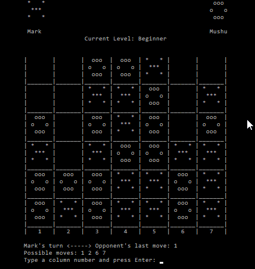

ConnectX
=====================
**ConnectX** is an interactive cross-platform C++ application based on the classical Connect Four game. 
It offers more variants in terms of the number of pieces to connect and the size of the board.



There is no GUI; this is a text-based application.

Computer strategy uses a version of the Minimax with alpha-beta pruning.

It was a **pet-project** to try a more generic design of the game.
It should be reasonably simple to add another variant with more players or dimensions.

Variants:
---------
- 6-by-7 ConnectFour
- 7-by-10 ConnectFour
- 8-by-8 ConnectFour    
- 3-by-6 Connect Three          
- Five-in-a-Row          

Features and Commands:
----------------------
It is possible to play against the computer or another human player.

- Undo `u`
- Restart program `r`
- Change difficulty level `d`
- Quit game  `q`


Author
------
Franck Nassé (original version coded in February 2016)


Build Requirements
------------
- C++ compiler which supports C++11 at least.
- [Ncurses library](https://www.gnu.org/software/ncurses/) 
Example
> Installation for Centos

```sudo yum install ncurses-devel```


- Windows (PDCurses 3.8)


Build
------
On Linux:

At the project root directory
- `make clean`
- `make release`

the program is generated in the `./binary/bin/` folder

start the program by typing `./binary/bin/ConnectX`

On Windows with MinGW:

- Install PDCurses at `C:\PDCurses-3.8`
- [CodeLite](https://codelite.org/) IDE can be used; the workspace is located in the `ConnectXProject` folder.
- Modify the project according to the location of `pdcurses.dll` or `pdcurses.a` on your system.

Remarks
-------
Adjust the size of the terminal (Fullscreen).

Sometimes flickering can occur.